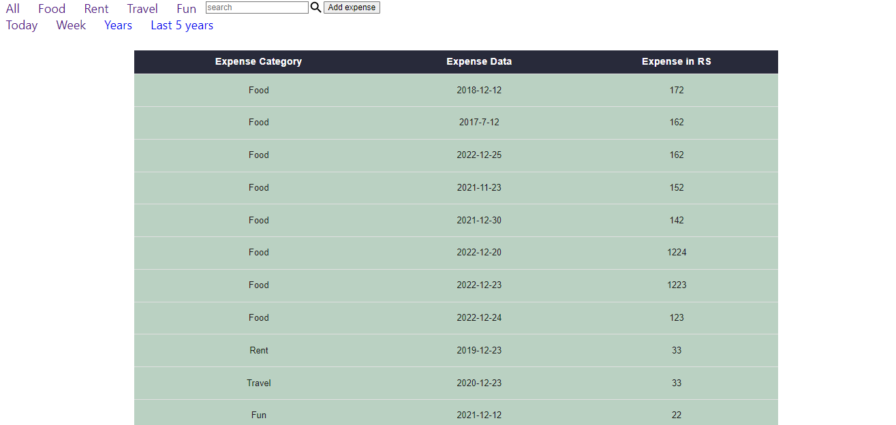
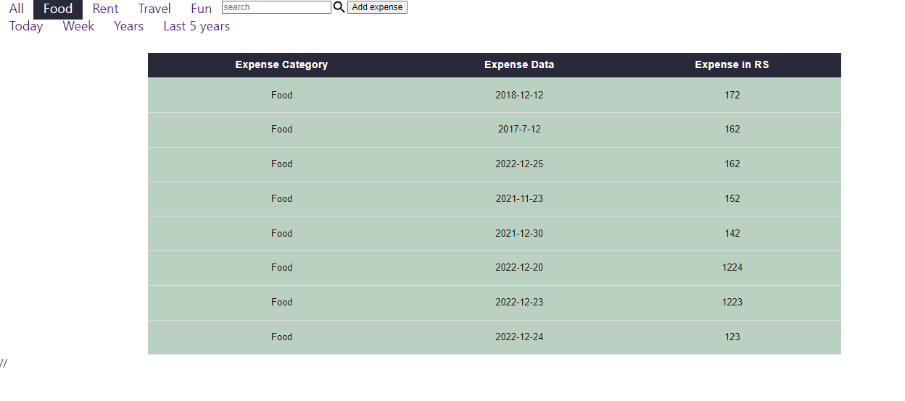
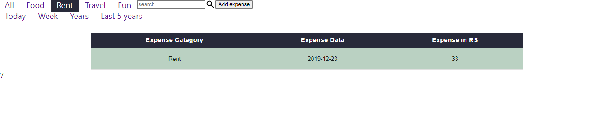
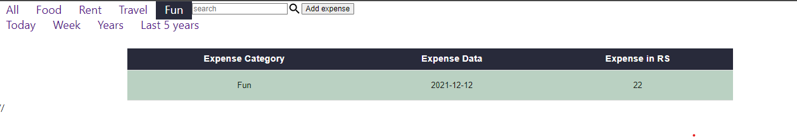
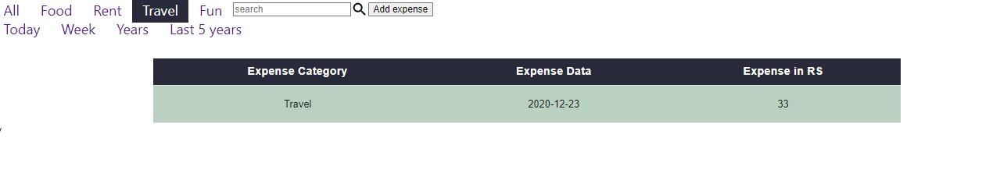

## Project Description

This project is a budget tracking application built using React and TypeScript. It allows users to manage their income and expenses by providing an easy-to-use interface for creating, editing and deleting transactions. The application utilizes a user-friendly interface and provides the ability to view their budget status in real-time, including a pie chart representation of their expenses by category. The system also allows for searching and filtering transactions based on specific criteria such as date and category. Additionally, the project includes a feature to export transactions to a CSV file. The system has an admin panel to manage all transactions. Overall, this project is a comprehensive solution for managing and tracking personal budgets using the power of React and TypeScript.

## Technology Used :

- ReactJs : JavaScript's library React.js is used to develop the application.
- JavaScript :  JavaScript's basics and some advanced concepts 
- JSX : JavaScript XML is used to structure the page and using Different UI components inside React.js.
- Make style : React Style for the styling
- MUI : react MUI
- Routing : nested Routing
## What I've Learnt :

I have Learnt :
- In this project, I learnt MUI table
- And also learnt about make style
- Nested routing 
- fetch constant data
## Setup Project

Get a clone of application from [Here](https://github.com/sachinrao-dev/budget-tracker-react-typescript)
### `npm start`

Runs the app in the development mode. Open [http://localhost:3000](http://localhost:3000) to view it in your browser.
The page will reload when you make changes. You may also see any lint errors in the console.

## Initial View of Application

## after clicked on food tab

## after clicked on rent tab

## after clicked on Fun tab

## after clicked on Travel tab

